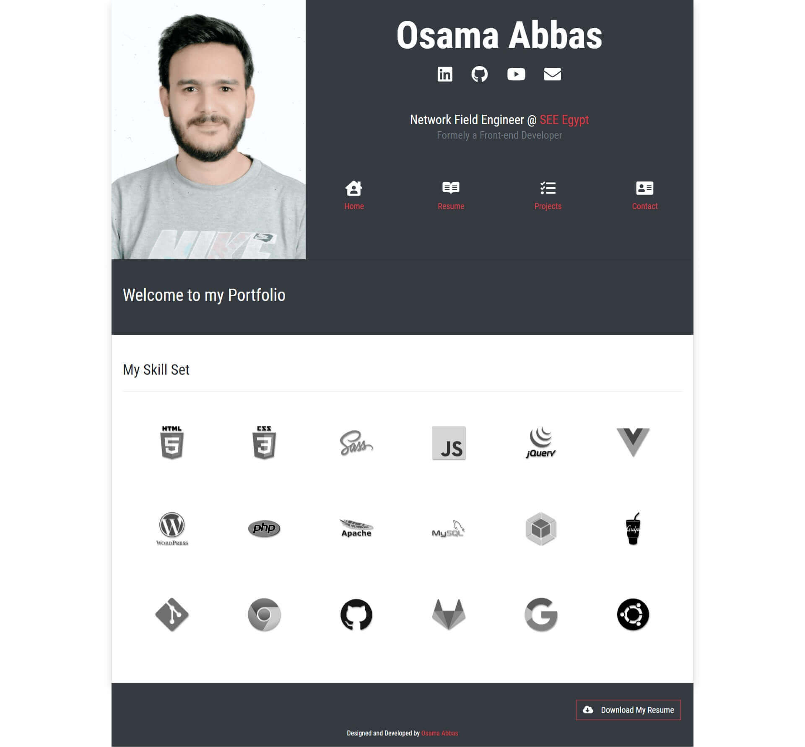

# Osama Abbas a.k.a tes3awy Portfolio

  

## Table of Contents
- [Preview](#preview)
- [Changelog](#changelog)

---

## Preview

---

## Changelog

**5 January 2021**

1. Updated all packages.
2. Removed unused packages.
3. Updated preview.
4. Updated netlify URL.
5. Updated `README.md`.
6. Added minor adjustments.

**11 January 2021**

1. Updated packages.
2. Changed brands' color codes.
3. Updated gulp tasks.
4. Added GTM.

**12 January 2021**

1. Preserved last collapse tab on page refresh.
2. Minor UI changes.
3. Added `gulp-csso`.
4. Updated preview.

**13 January 2021**

1. Added `.active` to the current accordion tab.
2. Smushed projects images.
3. Converted all project images to `.jpg`.
4. Added AlexSeeds project.
5. Removed and renamed some classes.
6. Updated resume.
7. Added Twitter Card meta tags.
